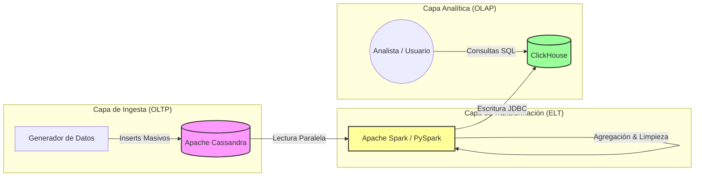

# Diagrama de Arquitectura - Proyecto Data Pipeline

Este diagrama ilustra el flujo de datos desde la generación y captura transaccional hasta el análisis OLAP, destacando las tecnologías y capas utilizadas.

## Descripción de Componentes

1.  **Apache Cassandra (OLTP):** Base de datos NoSQL orientada a columnas, optimizada para escrituras masivas. Almacena los datos crudos (`ventas_crudas`).
2.  **Apache Spark (ELT):** Motor de procesamiento distribuido. Lee los datos particionados de Cassandra, realiza agregaciones (suma de ventas, conteo de transacciones) y transformación de tipos de datos.
3.  **ClickHouse (OLAP):** Data Warehouse columnar. Almacena los datos procesados (`ventas_resumen`) optimizando la compresión y la velocidad de consulta para reportes analíticos.
