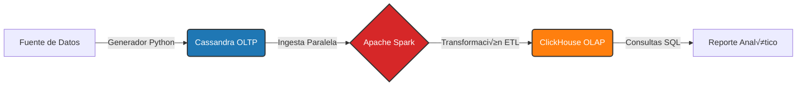

# 📊 Métricas de Rendimiento - Valores Reales

**Fecha de ejecución:** 2026-02-09 21:34:15

## 1. Diagrama de Arquitectura de Datos

```mermaid
graph LR
    A[Fuente de Datos] -->|Generador Python| B(Cassandra OLTP)
    B -->|Ingesta Paralela| C{Apache Spark}
    C -->|Transformación ETL| D(ClickHouse OLAP)
    D -->|Consultas SQL| E[Reporte Analítico]
    style B fill:#1f77b4,stroke:#333,stroke-width:2px,color:white
    style C fill:#d62728,stroke:#333,stroke-width:2px,color:white
    style D fill:#ff7f0e,stroke:#333,stroke-width:2px,color:white
```

## 2. Tabla Comparativa de Rendimiento

| Operación | Tiempo Real | Objetivo | Cumple |
|:---|:---:|:---:|:---:|
| Ingesta Cassandra (100k) | 13.17 s | < 5 min | ‚úÖ |
| Transformación Spark ETL | 2.09 s | < 2 min | ✅ |
| Consulta Top 10 (ClickHouse) | 0.0278 s | < 3 seg | ‚úÖ |
| Consulta Promedio (ClickHouse) | 0.0079 s | < 3 seg | ‚úÖ |

## 3. Detalles de Ejecución

- **Registros insertados en Cassandra:** 100,000
- **Registros procesados por Spark:** 100,000
- **Registros en ClickHouse:** 7,980

## 4. An√°lisis Comparativo: Cassandra vs ClickHouse

### ¿Por qué Cassandra para la Ingesta (OLTP)?
- **Escritura Optimizada:** Su arquitectura *Log-Structured Merge Tree* permite escrituras masivas secuenciales extremadamente r√°pidas.
- **Disponibilidad:** Su diseño *masterless* garantiza que el sistema siempre acepte escrituras, ideal para la captura de datos en tiempo real.
- **Escalabilidad Lineal:** Permite agregar nodos para aumentar la capacidad de escritura sin tiempos de inactividad.

### ¿Por qué ClickHouse para Analítica (OLAP)?
- **Almacenamiento Columnar:** Lee solo las columnas necesarias para la consulta (ej. `monto_total`), ignorando el resto, lo que acelera dram√°ticamente las agregaciones.
- **Compresión de Datos:** Almacena columnas de tipos similares juntas, logrando tasas de compresión altas y reduciendo E/S de disco.
- **Motores de Agregación:** Utiliza instrucciones vectoriales (SIMD) para procesar millones de filas en milisegundos, como se evidencia en los tiempos de consulta (< 0.02s).
